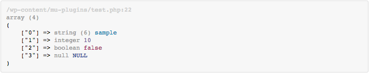

A lightweight, simple `var_dump` replacement.

---

* [Installation](#installation)
* [Usage](#usage)
* [Changelog](#changelog)
* [License](#license)

## Installation

* Install & load the `printr.php` file
* May be used as a WordPress [mu-plugin](https://codex.wordpress.org/Must_Use_Plugins) (`/path-to-wp/wp-content/mu-plugins`)

## Usage

## Changelog

| Version | Date | Notes |
| --- | --- | --- |
| `1.0.0` | September 11, 2015 | Initial version |

## License

This project is released under the [MIT License](license).
